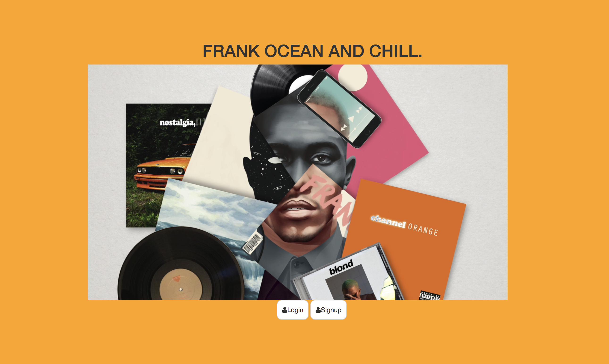

# FrankOceanAuth

How It's Made:
HTML, CSS, Javascript, EJS, node.JS MongoDB

About:
Frank ocean fan page! Fans can post messages to each other and listen to music!

Lesson Learned:
how to connect to an external server
the use of the Express package within the npm
debugging
creating and modifying Embedded Javascript Templates
Link: frankocean-d26a1a.netlify.app

Installation
Clone repo
run npm install
Usage
run ./folderDir/ node server.js
Navigate to localhost:8080
